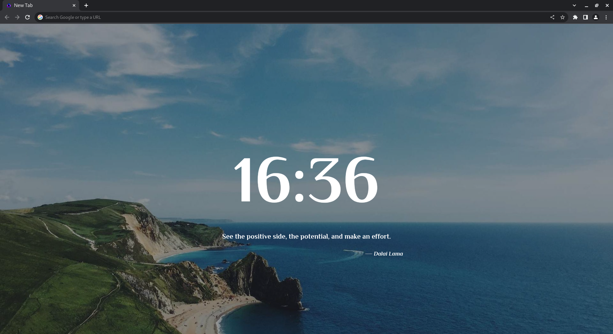

# Homen

This chrome extension will display a random quote every time you open a new tab.



## Installation

1. Clone this repository or download the ZIP file

```shell
git clone https://github.com/Fleserig73/Homen.git
```

2. Open Google Chrome and go to `chrome://extensions/` in your address bar.

3. Enable the "Developer mode" toggle on the top right corner of the page.

4. Click on the "Load unpacked" button and select the cloned/downloaded folder.

5. The extension should now be installed and ready to use.

## Usage

1. Open a new tab in Google Chrome.

2. You will see a random quote displayed along with the current weather information of your location.

## Customization

Feel free to customize the extension by modifying:

- The styling in `style.css` for layout and appearance changes.

## License

This project is licensed under the [MIT License](LICENSE).